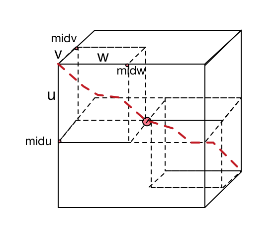
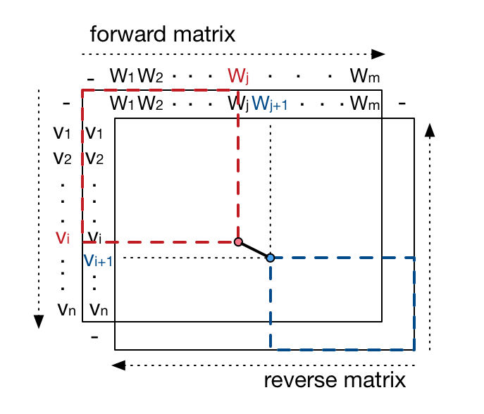

# Quadratic Space ThreeSeqAligner

Three DNA sequences global optimal alignment with O(N<sup>2</sup>) space complexity using divide-and-conquer and dynamic programming algorithms.

Usage:

```
./threeSeqAligner seq1.txt seq2.txt seq3.txt > output.txt
```

The output format is BLAST-like

```
# Sequences: seq1.txt: 556  seq2.txt: 569  seq3.txt: 627
# Running time: 9.55284
#===================================================================================================================
#
# Length: 631
# Score: 4752
# Identity: 427/631 (67.67%)
#
#===================================================================================================================
#
# 1     -----ACA-T-------T--C--------TC-CTTCTG------ATAGACTC--AG-GAAGCAATCATGGTGCTCTCTGCAGATGACAAAACCAACATCA    67
# 1     ----GACACT-------T--C--------TG-ATTCTG------ACAGACTC--AG-GAAGAAACCATGGTGCTCTCTGGGGAAGACAAAAGCAACATCA    69
# 1     CATAAACCCTGGCGCGCTCGCGGCCCGGCACTCTTCTGGTCCCCACAGACTCAGAGAGAACCCACCATGGTGCTGTCTCCTGCCGACAAGACCAACGTCA   100
#            **  *       *  *            *****      * ******  ** ***   * ********* ***   *  ***** * **** ***
#
# 68    AGAACTG-CTGGGGGAAGATTGGTGGCCATGGTGGTGAATATGGCGAGGAGGCCCTACAGAGGATGTTCGCTG-CCTTCCCCACCACCAAGACCTACTTC   165
# 70    AGG-CTGCCTGGGGGAAGATTGGTGGCCATGGTGCTGAATATGGAGCTGAAGCCCTGGAAAGGATGTTTGCTA-GCTTCCCCACCACCAAGACCTACTTC   167
# 101   AGG-CCGCCTGGGGTAAGGTCGGCGCGCACGCTGGCGAGTATGGTGCGGAGGCCCTGGAGAGGATGTTC-CTGTCCTTCCCCACCACCAAGACCTACTTC   198
#       **  * * ****** *** * ** *  ** * **  ** ***** *  ** *****  * ********  **   *************************
```

The global pairwise sequence alignment problem is defined as

> Given two sequences *v* and *w*, find the alignment with the minimal total cost of editing *v* into *w*, with given scores of match, mismatch, insertion and deletion.

The problem can be sloved optimally using dynamic programming ([Needleman–Wunsch algorithm](https://en.wikipedia.org/wiki/Needleman%E2%80%93Wunsch_algorithm)) to fill a 2D grid, in time and space complexity of O(N<sup>2</sup>). A generalization of this problem is to find the optimal alignment for three or more sequences. However, for *k* sequences, using the naive dynamic programming approach would take O(N<sup>k</sup>) complexity in time and space. 

For three sequence alignment, apply a divide-and-conquer approach to the original algorithm could reduce the space complexity from O(N<sup>3</sup>) to O(N<sup>2</sup>). Suppose we have three sequences v=ACGTGT, w=CGTCTTT, u=AGTGGT, with length *n, m ,l*, respectively. Assume an optimal alignment is

```
v  A  C  G  T  -  G  T  -
w  C  -  G  T  C  T  T  T
u  A  -  G  T  G  G  T  -
```

If we divide this optimal alignment into two parts,
```
v  A  C  G  T  |  -  G  T  -
w  C  -  G  T  |  C  T  T  T
u  A  -  G  T  |  G  G  T  -
```

note the left part of alignment is an optimal alignment for sequences v<sup>1</sup>=ACGT, w<sup>1</sup>=CGT,u<sup>1</sup>=AGT; and the right part of alignment is an optimal alignment for sequences v<sup>2</sup>=GT, w<sup>2</sup>=CTTT, u<sup>2</sup>=GGT, according to the optimal substructure property of dynamic programming.

Then if we have the optimal alignment A<sup>1</sup> and A<sup>2</sup> for v<sup>1</sup>,w<sup>1</sup>,u<sup>1</sup> and v<sup>2</sup>,w<sup>2</sup>,u<sup>2</sup>, we can concatenate A<sup>1</sup>, A<sup>2</sup> to form an optimal alignment *A* for *v,w,u*, and score(A)=score(A<sup>1</sup>)+score(A<sup>2</sup>).



So the key here is to **find how to divide the three sequences without knowing the optimal alignment**.

We can use the midpoint *midu* of *u* as an anchor, to find the corresponding partition points *midv*, *midw* in *v* and *w*. For every choice of *midv*, *midw*, we partition *v, w, u*, and compute an optimal score for v<sub>1:midv</sub>, w<sub>1:midw</sub>, u<sub>1:midu</sub> and an optimal score for v<sub>midv+1:n</sub>, w<sub>midw+1:m</sub>, u<sub>midu+1:l</sub>, and sum up those two scores. **Among all possible choices of *midv, midw*, the one gives the maximum sum up score is the correct positions to partition v and w**, otherwise the concatenate alignment won't be optimal.

For all possible optimal scores for v<sub>1:midv</sub>, w<sub>1:midw</sub>, u<sub>1:midu</sub>, we just need to compute the last layer of the scores for *v, w, u<sub>1:midu</sub>*. For all possible optimal scores for v<sub>midv+1:n</sub>, w<sub>midw+1:m</sub>, u<sub>midu+1:l</sub>, we can reverse *v, w, u<sub>midu+1:l</sub>*, and take the last layer of scores computed. The score computation step can be done in quadratic space since we only need the previous layer to compute the current layer.


